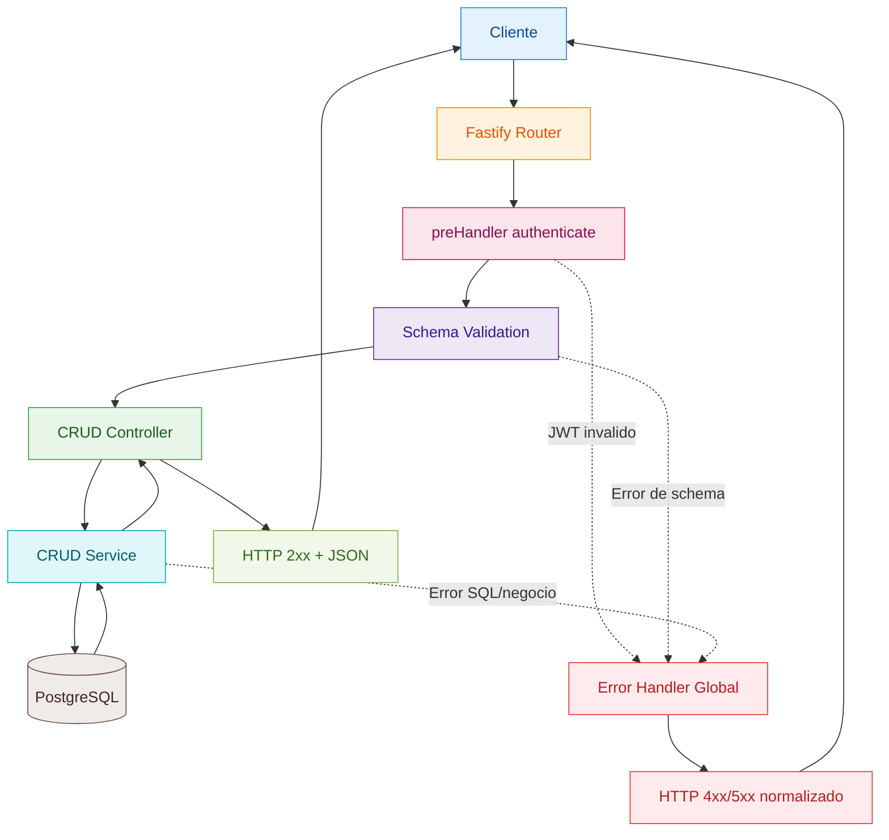
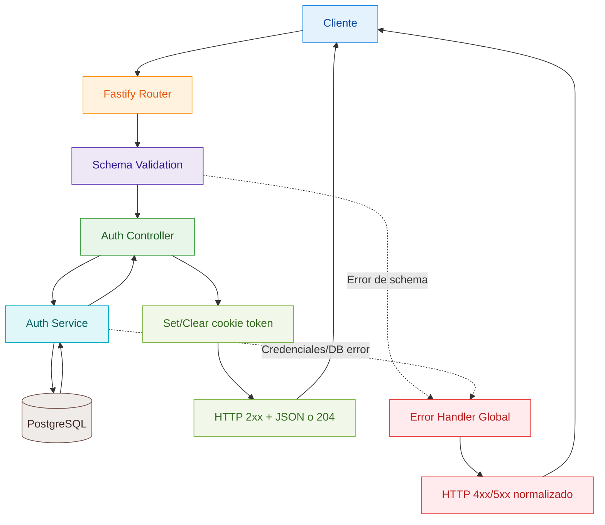

# Manual Interno del Backend (Fastify)

## Objetivo del Backend

Este servicio implementa un modelo **CRUD generado por configuracion**.

La fuente de verdad para exponer recursos es `src/config/resources.js`. A partir de esa configuracion se generan rutas, schemas de validacion y SQL parametrizado sin crear un controlador por entidad de forma manual.

Este manual esta orientado a equipo interno: onboarding, mantenimiento y cambios seguros.

## Mapa Rapido de Componentes

| Capa | Archivo(s) principal(es) | Responsabilidad |
| --- | --- | --- |
| Bootstrap | `src/server.js`, `src/app.js` | Levantar Fastify, registrar plugins, rutas y errores globales |
| Config de recursos | `src/config/resources.js` | Definir contratos CRUD por recurso |
| Routing | `src/routes/crud.js`, `src/routes/auth.js` | Registrar endpoints genericos y endpoints de autenticacion |
| Validacion | `src/schemas/crud.js`, `src/schemas/auth.js` | Generar JSON Schemas para body/query/params |
| Controladores | `src/controllers/crud.js`, `src/controllers/auth.js` | Adaptar request/response hacia servicios |
| Servicios | `src/services/crud.js`, `src/services/auth.js` | Construir y ejecutar SQL con reglas de ownership |
| Errores | `src/utils/errors.js` | Estandarizar errores de dominio y de base de datos |

## Flujo de una Request (Version Simple)

Para lectura humana, piensa en este orden fijo:

1. Entra request HTTP.
2. Fastify resuelve ruta.
3. Si es `/api/*`, corre `authenticate`.
4. Se valida input con schema (params/query/body).
5. Controller invoca Service.
6. Service ejecuta SQL.
7. Se construye respuesta y se envia.
8. Si hay error en cualquier punto, lo normaliza el error handler global.

Diagrama para rutas `/api/*` (CRUD) en GitHub:

Diagrama para rutas `/auth/*` en GitHub:

## Inicializacion y Seguridad Base (app.js)

En `src/app.js` se configura:

- `@fastify/cookie` y `@fastify/jwt` con cookie `token`.
- Decorator `jwtCookieOptions` con `httpOnly`, `secure`, `sameSite`.
- Decorator `authenticate` que obliga JWT valido y normaliza `request.user.sub` a `number`.
- Prefijo `/api` protegido con `preHandler: authenticate`.
- Prefijo `/auth` con rutas de login/registro/logout.
- `setErrorHandler` global para mapear excepciones a respuesta uniforme.

## CRUD Generico Basado en Configuracion

### 1) Definicion de Recurso

Cada recurso en `src/config/resources.js` define:

- `path`: segmento URL (ej. `companies` -> `/api/companies`).
- `table`: tabla SQL.
- `idColumn`: PK o identificador logico.
- `fields`: campos permitidos para escritura (`POST`, `PATCH`).
- `createRequired`: campos obligatorios en `POST`.
- `ownership`: politica de acceso por usuario.
- `allowCreate`: habilita/deshabilita `POST`.
- `createGuard` (opcional): control adicional de pertenencia en relaciones padre-hijo.
- `hasUpdatedAt`: indica si en `PATCH` se fuerza `updated_at = now()`.

### 2) Generacion de Rutas

`src/routes/crud.js` recorre `resourceList` y registra automaticamente:

- `GET /api/<resource>`
- `POST /api/<resource>` (solo si `allowCreate: true`)
- `GET /api/<resource>/:id`
- `PATCH /api/<resource>/:id`
- `DELETE /api/<resource>/:id`

### 3) Validacion Dinamica de Schema

`src/schemas/crud.js` construye schemas JSON a partir de `fields`:

- `additionalProperties: false` en body de `create` y `update`.
- `minProperties: 1` en `PATCH`.
- `id` validado como entero positivo en rutas por ID.
- `limit` y `offset` validados en listados (`limit` maximo 100).

## Modelo de Ownership (Control de Acceso)

`src/services/crud.js` aplica reglas por recurso con `buildOwnership(...)`:

| `ownership.type` | Regla aplicada |
| --- | --- |
| `none` | Sin filtro por usuario (`TRUE`) |
| `userColumn` | `t.<userColumn> = $n` |
| `selfUser` | `t.<idColumn> = $n` (solo su propio registro) |
| `existsJoin` | Predicado `EXISTS (...)` con user id inyectado como parametro |

Reglas practicas:

- Todas las operaciones usan placeholders SQL (`$1`, `$2`, ...).
- `sanitizePayload` descarta claves fuera de `fields` o valores `undefined`.
- En `userColumn`, el `user_id` se fuerza desde JWT (`withOwnerFieldIfNeeded`).
- `createGuard` evita crear hijos referenciando recursos no propios (retorna `403`).

## Contrato de Endpoints

### Respuestas CRUD

- `GET list`: `200` -> `{ data: [...] }`
- `GET by id`: `200` -> `{ data: {...} }`, `404` si no existe o no pertenece
- `POST`: `201` -> `{ data: {...} }`
- `PATCH`: `200` -> `{ data: {...} }`, `404` si no existe/no pertenece
- `DELETE`: `204` sin body, `404` si no existe/no pertenece

### Autenticacion

Rutas manuales en `src/routes/auth.js`:

- `POST /auth/register`
- `POST /auth/login`
- `POST /auth/logout` (requiere auth)

Implementacion:

- `register`: inserta usuario con password hasheado.
- `login`: valida credenciales y setea cookie `token` (JWT).
- `logout`: limpia cookie `token`.

## Modelo de Errores

`src/utils/errors.js` define `HttpError` y normaliza respuestas:

- Errores de dominio -> `{ error: { code, message, details } }`
- `23505` (unique violation) -> `409 CONFLICT`
- `23503` (foreign key violation) -> `400 FK_VIOLATION`
- No controlado -> `500 INTERNAL_ERROR`

Esto garantiza un formato de error consistente para frontend e integraciones.

## Runbook de Cambios (Uso Diario)

### Caso A: Agregar Columna a Tabla Existente

1. Crear migracion SQL.
2. Agregar campo en `fields` del recurso.
3. Si aplica, agregarlo en `createRequired`.
4. Declarar `enum` o `format` si corresponde.
5. Validar con tests de API.

Si solo cambias la DB y no la configuracion, la API no expone ese campo.

### Caso B: Agregar Recurso (Tabla Nueva)

1. Crear migracion SQL.
2. Agregar recurso en `src/config/resources.js`.
3. Definir ownership correcto (`none`, `userColumn`, `selfUser`, `existsJoin`).
4. Agregar `createGuard` si hay dependencia de recurso padre del usuario.
5. Probar ciclo CRUD completo.

No es necesario crear rutas/controladores/schemas por entidad mientras el caso encaje en CRUD generico.

## Cuando Salir del CRUD Generico

Crear endpoints manuales (`routes` + `controller` + `service`) cuando haya:

- Transacciones complejas en multiples tablas.
- Comandos de dominio no CRUD (`submit`, `approve`, `close`).
- Validaciones de negocio avanzadas.
- Consultas agregadas o reportes especializados.

## Checklist Operativo

### Antes de abrir PR

- [ ] Probaste al menos: create, list, getById, update, delete del recurso tocado.
- [ ] Validaste que no se puedan escribir campos fuera de `fields`.
- [ ] Verificaste comportamiento con usuario propietario y usuario no propietario.

### Cambios de schema

- [ ] Migracion SQL creada y aplicada.
- [ ] `fields` actualizado.
- [ ] `createRequired` revisado.
- [ ] `enum`/`format` revisado.

### Cambios de seguridad

- [ ] `ownership` validado para cada operacion.
- [ ] `createGuard` validado en relaciones padre-hijo.
- [ ] Casos `401`, `403`, `404` verificados.

### Calidad

- [ ] Tests de API actualizados.
- [ ] Lint y validaciones ejecutadas.
